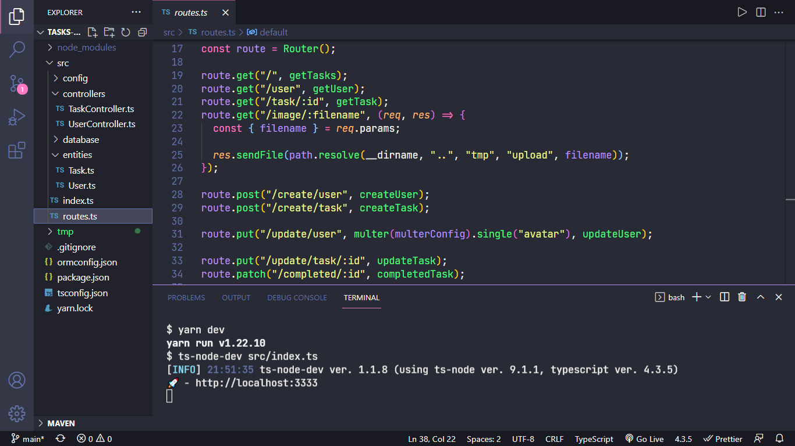

<h1 align="center">Tasks - API</h1>

<h1 align="center">
  
</h1>

## 🧪 Tecnologias

Esse projeto foi desenvolvido com as seguintes tecnologias:

- Node.js
- TypeScript
- Express
- Multer
- TypeORM
- MySQL

## 🚀 Como executar

Antes você deverá acessar o arquivo <b>ormconfig.json</b>, e altere os campos relacionados ao banco de dados, conforme está configurado na sua máquina.

E criar um banco de dados, com o nome que deseja, seguindo o caminho <b>src/database</b>, você encontrará o arquivo <b>database.sql</b> com o comando SQL para criar o banco de dados

Para iniciá-lo, siga os passos abaixo:

```bash
# Instalar as dependências
$ yarn

# Criar as tabelas do banco de dados.
$ yarn typeorm migration:run

# Iniciar o projeto
$ yarn dev
```

A API estará disponível no endereço http://localhost:3333.

## 💻 Projeto

Tasks - API, é um projeto desenvolvido na função de ser o BACK-END do projeto [Tasks](https://github.com/xpedroleonardo/Tasks), para realizar o CRUD das informações guardadas no banco de dados.

## 📝 License

Esse projeto está sob a licença MIT. Veja o arquivo [LICENSE](LICENSE) para mais detalhes.

---

Feito com ❤ by [Pedro Leonardo](https://github.com/xpedroleonardo)
